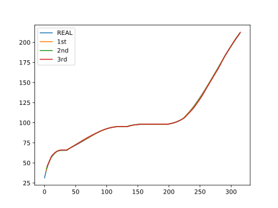
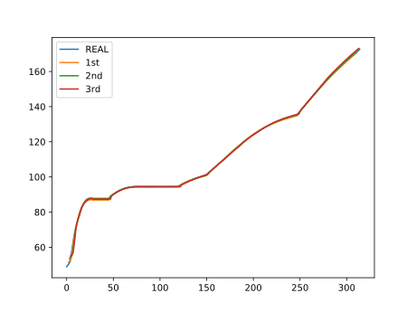

# Tool Wear Forecasting By DL

This program is used to forecast upcoming tool wear by LSTM

The speed is ultra-fast and final score is beyond satisfactory.

# Result

`1st`,`2nd` and `3rd` is corresponding to forecasting three timestep 

MAE is lower than 1 and result is beyond satisfactory

In addition, we have also test how to make RNN chained for long-term tool wear forecasting. If you feel interest, you can follow the video in `seq2seq_tool_wear`

which named as 

+ cut_1.mp4
+ cut_2.mp4
+ cut_3.mp4

## Watch them on Youtube?

+ cut_1 : [https://youtu.be/arKw_D7j5pc](https://youtu.be/arKw_D7j5pc)
+ cut_2 : [https://youtu.be/n-Pyet1UJEg](https://youtu.be/n-Pyet1UJEg)
+ cut_3 : [https://youtu.be/CANADaKSgac](https://youtu.be/CANADaKSgac)

Anyway, please feel free to ask me if you need further help

# LICENSE

MIT LICENCE