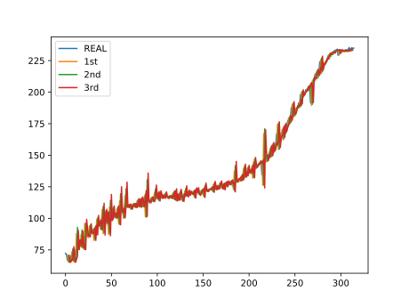

# Tool Wear Forecasting By DL

This program is used to forecast upcoming tool wear by LSTM

The speed is ultra-fast and final score is beyond satisfactory.

# Result

`1st`,`2nd` and `3rd` is corresponding to forecasting three timestep 

MAE is lower than 1 and result is beyond satisfactory

